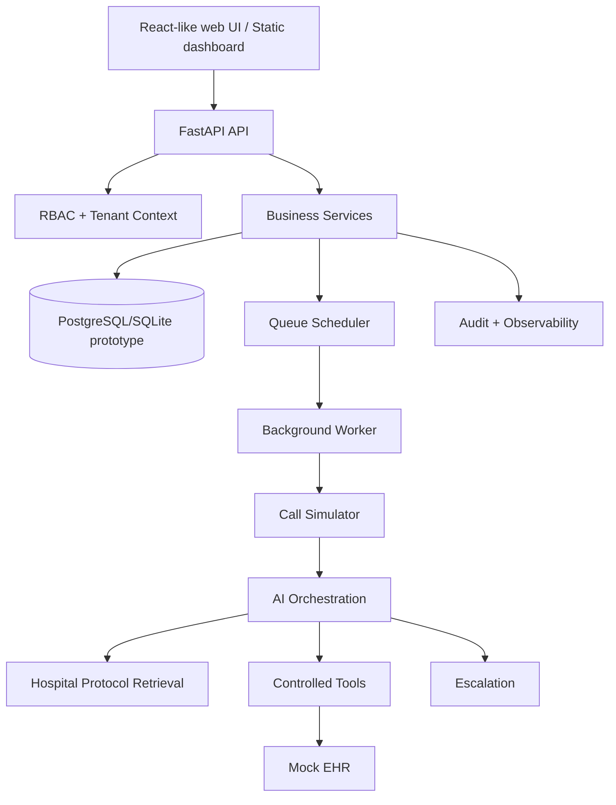

# Architecture

AI is treated as a bounded decision-support component. It cannot directly manipulate database tables. Tool requests should pass authorization, schema/business validation, execution, and audit in a production implementation.

Tenant context is derived from the authenticated user and applied to patient/campaign/protocol/escalation queries.
